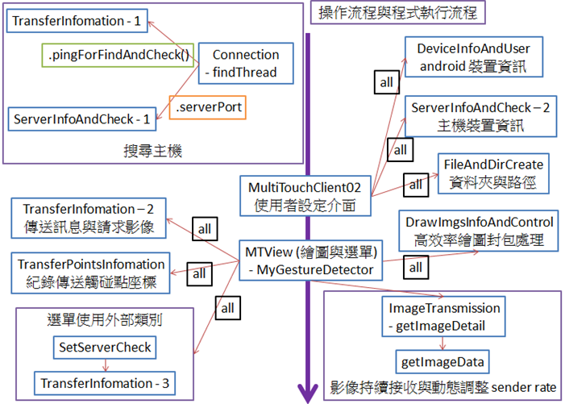

# Multi-Transmission Framework

開發與定義多種 Android 底層傳輸內容框架，透過自定義通訊協定，達到伺服器端與客戶端的互動式、雙向訊息交換，包含多點觸碰訊息即時交換並呈現、畫面即時同步等外，並提供一系列 high level 應用函式庫，如畫面編輯等，供軟體開發工程師等快速佈署 android 相關應用程式。

## Demo

實作範例影片 : https://www.youtube.com/watch?v=hpVbVmZXjFo

 

## Architecture

* 架構圖說明
  * 藍色框為類別，’-’ 表示有定義內部類別
  * 綠色框為使用的成員函式，橘色為使用的資料成員，黑色為全部使用
  * 紅色箭頭表示為使用到的類別，有產生物件
  * (類別)-1, -2, -3 表示為產生的物件數目

